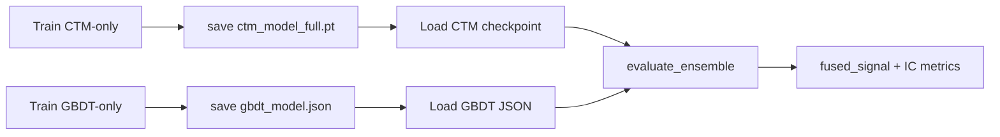

# Pretrained Weight Loading for Ensemble Training

> **Purpose**: Guide for loading pre-trained CTM and GBDT weights into the ensemble fusion pipeline.
> **Covers**: Architecture overview, configuration reference, CLI usage, workflow scenarios, serialization format.
> **Last updated**: 2026-06-03

---

## Table of Contents

1. [Architecture Overview](#1-architecture-overview)
2. [Use Cases](#2-use-cases)
3. [Configuration Reference](#3-configuration-reference)
4. [CLI Usage](#4-cli-usage)
5. [Programmatic API](#5-programmatic-api)
6. [Serialization Format](#6-serialization-format)
7. [Workflow Scenarios](#7-workflow-scenarios)
8. [Verification](#8-verification)
9. [Troubleshooting](#9-troubleshooting)

---

## 1. Architecture Overview

The ensemble training pipeline supports **loading pre-trained weights** at two levels:

### Level 1: Inference-Only Fusion (scripts/infer.py)

```
Pre-trained CTM (.pt) ──→ forward() ──→ ctm_pred
                                              ↓
                                     evaluate_ensemble()
                                              ↓
Pre-trained GBDT (.json) → predict() → gbdt_pred
                                              ↓
                                         fused_signal
```

This path does **not** require re-running walk-forward training. It loads both models from disk and fuses their predictions on new data.

### Level 2: Ensemble Trainer with Pretrained Init (scripts/train.py --ensemble)

```
                    ┌─── [Optional] Pre-trained CTM state_dict ───┐
                    │                                              ▼
Walk-forward loop  ──→  Stage 1: init CTM from checkpoint or scratch
                    │         → Stage 2: extract hidden states → build GBDT features
                    │         → Stage 3: train GBDT or load pre-trained GBDT
                    │         → Stage 4: IC-weighted fusion
                    │                                              ▲
                    └─── [Optional] Pre-trained GBDT JSON ─────────┘
```

Supports:
- **Skip CTM training**: Use a pre-trained CTM checkpoint across all windows (inference mode)
- **Warm-start CTM**: Initialize CTM weights from a checkpoint for each window, then fine-tune
- **Pre-loaded GBDT**: Load GBDT from JSON instead of training from scratch
- **Full ensemble inference**: Load both CTM + GBDT → fuse → report metrics
- **Hybrid**: Fine-tune CTM while keeping GBDT frozen, or vice versa

### Data Flow

```
CLI args → EnsembleWalkForwardTrainer.__init__()
              │
              ├── pretrained_ctm_state_dict (OrderedDict | None)
              │   └── loaded via serialization.load_ctm_model()
              │
              ├── pretrained_gbdt_json (str | None)
              │   └── loaded via serialization.load_gbdt_model()
              │
              ├── skip_ctm_training (bool)
              │   └── if True → use pretrained CTM without fine-tuning
              │
              └── skip_gbdt_training (bool)
                  └── if True → use pretrained GBDT without re-training
```

---

## 2. Use Cases

### Use Case A: Train CTM and GBDT Independently, Then Fuse

```
Step 1: Train CTM-only → save to ckpt_ctm/
          python scripts/train.py --config default.yaml --save-dir ckpt_ctm/

Step 2: Train GBDT-only → save to ckpt_gbdt/
          python scripts/train_gbdt_only.py --data-dir /data --save-dir ckpt_gbdt/

Step 3: Ensemble inference with both pre-trained models
          python scripts/train.py --config default.yaml \
            --multi-asset --n-assets 200 \
            --device cuda \
            --ensemble-inference \
            --init-ctm-ckpt ckpt_ctm/ctm_model.pt \
            --init-gbdt-json ckpt_gbdt/gbdt_model.json
```

### Use Case B: Warm-Start CTM Training

Continue training from a previous checkpoint:

```
python scripts/train.py --config configs/default.yaml \
  --ensemble \
  --init-ctm-ckpt checkpoints/previous_run/ctm_model.pt
```

### Use Case C: Ensemble Inference on New Data

```
python scripts/train.py --config configs/default.yaml \
  --multi-asset --n-assets 200 \
  --ensemble-inference \
  --init-ctm-ckpt /root/models/ctm_seed456/ctm_model.pt \
  --init-gbdt-json /root/models/gbdt_only/gbdt_model.json \
  --output results/ensemble_inference_results.json
```

### Use Case D: GBDT-Only Evaluation with CTM Features

Train CTM, then evaluate GBDT on CTM hidden states:

```
python scripts/train.py --config configs/default.yaml \
  --multi-asset --n-assets 200 \
  --ensemble \
  --init-ctm-ckpt ckpt_ctm/ctm_model.pt \
  --skip-ctm-training \
  --gbdt-trees 200 --gbdt-depth 6
```

---

## 3. Configuration Reference

### CLI Args (scripts/train.py)

| Argument | Type | Default | Description |
|----------|------|---------|-------------|
| `--init-ctm-ckpt` | str | `None` | Path to pre-trained CTM `.pt` checkpoint (state_dict or full) |
| `--init-gbdt-json` | str | `None` | Path to pre-trained GBDT `.json` model |
| `--skip-ctm-training` | bool | `False` | Skip CTM training stages; use pre-trained weights as-is |
| `--skip-gbdt-training` | bool | `False` | Skip GBDT training stages; use pre-trained GBDT as-is |
| `--ensemble-inference` | bool | `False` | Run ensemble inference-only mode: load both models, fuse, report metrics. No walk-forward training. |

### EnsembleWalkForwardTrainer __init__ Parameters

| Parameter | Type | Default | Description |
|-----------|------|---------|-------------|
| `pretrained_ctm_state_dict` | `OrderedDict \| None` | `None` | Pre-trained CTM state_dict to initialize model weights |
| `pretrained_gbdt_json` | `str \| None` | `None` | Path to pre-trained GBDT JSON model |
| `skip_ctm_training` | bool | `False` | If True, use pretrained_ctm_state_dict without fine-tuning |
| `skip_gbdt_training` | bool | `False` | If True, load pretrained_gbdt_json without re-training |

### Model Params Compatibility

When loading pre-trained weights, the `model_params` used to construct the model architecture **must match** the config used during the original training:

```python
# MUST match:
#   model_dim, state_dim, n_layers, input_dim, ...
# stored in:
#   checkpoint["model_params"]  (from ctm_model_full.pt)
#   OR matching config YAML
```

The `serialization.load_ctm_model()` helper handles this:

```python
from src.utils.serialization import load_ctm_model

model = load_ctm_model(
    model_class=MultiAssetCTM,
    model_params=model_params,  # from config or checkpoint metadata
    state_path="ctm_model_full.pt",
    device="cuda",
)
```

---

## 4. CLI Usage

### CTM-Only Training → Save Checkpoint

```bash
python scripts/train.py \
  --config configs/default.yaml \
  --data-dir /root/data/tencent/ \
  --multi-asset --n-assets 200 \
  --device cuda \
  --save-dir /root/models/ctm_checkpoint/
```

Output:
```
/root/models/ctm_checkpoint/
├── ctm_model.pt              # state_dict only
├── ctm_model_config.yaml     # config copy
└── ctm_model_full.pt         # full checkpoint: state_dict + optimizer + config + model_params
```

### GBDT-Only Training → Save Model JSON

```bash
python scripts/train_gbdt_only.py \
  --data-dir /root/data/tencent/ \
  --n-assets 200 \
  --gbdt-trees 200 --gbdt-depth 6 \
  --save-dir /root/models/gbdt_checkpoint/
```

Output:
```
/root/models/gbdt_checkpoint/
└── gbdt_model.json           # tree structure (portable)
```

### Ensemble Inference with Both Pre-Trained Models

```bash
python scripts/train.py \
  --config configs/default.yaml \
  --data-dir /root/data/tencent/ \
  --multi-asset --n-assets 200 \
  --device cuda \
  --ensemble-inference \
  --init-ctm-ckpt /root/models/ctm_checkpoint/ctm_model.pt \
  --init-gbdt-json /root/models/gbdt_checkpoint/gbdt_model.json \
  --output /root/results/ensemble_inference.json
```

### Ensemble Training with CTM Warm-Start

```bash
python scripts/train.py \
  --config configs/default.yaml \
  --data-dir /root/data/tencent/ \
  --multi-asset --n-assets 200 \
  --device cuda \
  --ensemble \
  --init-ctm-ckpt /root/models/ctm_checkpoint/ctm_model.pt \
  --gbdt-trees 200 --gbdt-depth 6 \
  --save-dir /root/models/ensemble_warmstart/ \
  --output /root/results/ensemble_warmstart.json
```

---

## 5. Programmatic API

### Loading Pre-trained CTM into Ensemble Trainer

```python
import torch
from src.train.ensemble_trainer import EnsembleWalkForwardTrainer
from src.utils.serialization import load_ctm_model

# Load pre-trained CTM state dict
ckpt = torch.load("ctm_model_full.pt", map_location="cpu", weights_only=True)
pretrained_state = ckpt["model_state_dict"]  # full checkpoint
# OR from state_dict-only file:
pretrained_state = torch.load("ctm_model.pt", map_location="cpu", weights_only=True)

# Create ensemble trainer with pre-trained weights
trainer = EnsembleWalkForwardTrainer(
    model_class=MultiAssetCTM,
    model_params=model_params,
    loss_config=loss_config,
    gbdt_config={"num_trees": 200, "max_depth": 6},
    gbdt_loss="mse",
    device="cuda",
    pretrained_ctm_state_dict=pretrained_state,
    skip_ctm_training=False,  # False = warm-start (fine-tune), True = freeze
)

# Run walk-forward (first window uses pre-trained weights as starting point)
results = trainer.train_walk_forward(
    data=train_seq, targets=train_targ,
    train_window=400, val_window=80, ...
)
```

### Loading Pre-trained GBDT into Ensemble Trainer

```python
trainer = EnsembleWalkForwardTrainer(
    model_class=MultiAssetCTM,
    model_params=model_params,
    loss_config=loss_config,
    gbdt_config={...},
    device="cuda",
    pretrained_gbdt_json="/path/to/gbdt_model.json",
    skip_gbdt_training=True,  # use pre-trained GBDT as-is
)
```

### Standalone Ensemble Inference

```python
from src.train.ensemble_trainer import EnsembleWalkForwardTrainer
from src.model.ensemble import evaluate_ensemble, EnsembleConfig

trainer = EnsembleWalkForwardTrainer(
    model_class=MultiAssetCTM,
    model_params=model_params,
    loss_config=loss_config,
    device="cuda",
    pretrained_ctm_state_dict=ctm_state,
    pretrained_gbdt_json="/path/to/gbdt_model.json",
    skip_ctm_training=True,
    skip_gbdt_training=True,
)

# Run inference-only: load both models, forward through data, fuse
results = trainer.run_ensemble_inference(
    data=val_seq, targets=val_targ,
    batch_size=32,
)
# results contains: ctm_pred, gbdt_pred, fused_pred, ic_ctm, ic_gbdt, fused_ic
```

---

## 6. Serialization Format

### CTM Checkpoint Files

Two formats are supported for loading:

**Format A: state_dict only (ctm_model.pt)**
```python
# Direct state_dict, no metadata
state_dict = torch.load("ctm_model.pt", weights_only=True)
```

**Format B: Full checkpoint (ctm_model_full.pt)** — preferred
```python
ckpt = torch.load("ctm_model_full.pt", weights_only=True)
# Contains:
ckpt["model_state_dict"]      # nn.Module.state_dict()
ckpt["optimizer_state_dict"]  # optimizer state for resume
ckpt["epoch"]                 # epochs trained
ckpt["config"]                # full YAML config dict
ckpt["model_params"]          # model constructor kwargs
```

When loading via `--init-ctm-ckpt`:
1. If file is a full checkpoint (has `"model_state_dict"` key), extract from there
2. If file is a state_dict (flat tensor keys), load directly
3. Auto-detect by checking for `"model_state_dict"` key

### GBDT Model JSON

```json
{
  "init_pred": 0.00123,
  "trees": [
    {
      "split_feature": 5,
      "split_value": 0.45,
      "left": {
        "split_feature": 2,
        "split_value": -0.1,
        "left": {"leaf_value": 0.02},
        "right": {"leaf_value": -0.01}
      },
      "right": {"leaf_value": 0.005}
    }
    // ... 199 more trees
  ],
  "step_sizes": [0.1, 0.1, ...],
  "feature_importance": {...}
}
```

Format is compatible with Hoffnung's `GBDT.from_json()` and `GBDT.to_json()`.

### Ensemble Trainer State (for full resume)

```python
trainer_state = {
    "ctm_state_dict": model.state_dict(),
    "gbdt_json": gbdt_model.to_json(),
    "model_params": model_params,
    "config": cfg,
    "loss_config": loss_config,
    "gbdt_config": gbdt_config,
    "gbdt_loss": gbdt_loss,
    "feature_importance": gbdt_importance,
}
```

Saved via:
```python
from src.utils.serialization import save_ensemble_trainer_state
save_ensemble_trainer_state(trainer, save_dir)
# Output:
#   {save_dir}/ensemble_trainer_state.pt  — full trainer state
#   {save_dir}/ensemble_ctm.pt            — CTM weights
#   {save_dir}/ensemble_gbdt.json         — GBDT model
#   {save_dir}/ensemble_ctm_config.yaml   — config
```

---

## 7. Workflow Scenarios

### Scenario 1: Full Separate Training → Ensemble



Commands:
```bash
# Step 1: CTM
python scripts/train.py --config default.yaml --save-dir ckpt_ctm/

# Step 2: GBDT
python scripts/train_gbdt_only.py --save-dir ckpt_gbdt/

# Step 3: Ensemble inference
python scripts/train.py --config default.yaml --ensemble-inference \
  --init-ctm-ckpt ckpt_ctm/ctm_model.pt \
  --init-gbdt-json ckpt_gbdt/gbdt_model.json
```

### Scenario 2: CTM First → Add GBDT Later

```bash
# Train CTM only
python scripts/train.py --config default.yaml --save-dir ckpt_ctm/

# Pick up CTM checkpoint and add GBDT ensemble
python scripts/train.py --config default.yaml \
  --ensemble \
  --init-ctm-ckpt ckpt_ctm/ctm_model_full.pt \
  --save-dir ckpt_ensemble/
```

### Scenario 3: Ensemble Inference on Remote Server

After training both models on a GPU cloud instance, copy checkpoints to an inference server:

```bash
# On cloud GPU: train and save
python scripts/train.py ... --save-dir /root/models/ctm_model/
python scripts/train_gbdt_only.py ... --save-dir /root/models/gbdt_model/

# Copy to inference server
scp -r root@cloud:/root/models/ctm_model/ ./models/
scp -r root@cloud:/root/models/gbdt_model/ ./models/

# On inference server: ensemble inference
python scripts/train.py --config default.yaml \
  --ensemble-inference \
  --init-ctm-ckpt ./models/ctm_model/ctm_model.pt \
  --init-gbdt-json ./models/gbdt_model/gbdt_model.json \
  --output results/daily_signals.json
```

---

## 8. Verification

### Smoke Test: Load and Verify Checkpoint

```bash
python3 -c "
from src.utils.serialization import load_ctm_model
from src.model.multiasset_ctm import MultiAssetCTM

# Load CTM checkpoint
model = load_ctm_model(
    model_class=MultiAssetCTM,
    model_params={'n_assets': 200, 'input_dim': 20, 'model_dim': 64, 'state_dim': 16},
    state_path='/path/to/ctm_model.pt',
    device='cpu',
)
print(f'✅ CTM loaded: {sum(p.numel() for p in model.parameters()):,} params')

# Verify forward pass
import torch
x = torch.randn(4, 200, 63, 20)  # (B, N, T, D)
out = model(x)
print(f'✅ Forward OK: output shape {out.shape}')
"
```

### Smoke Test: Load and Verify GBDT JSON

```bash
python3 -c "
from gbdt import GBDT, GBDTConfig

model = GBDT(GBDTConfig())
model.from_json(open('/path/to/gbdt_model.json').read())
print(f'✅ GBDT loaded: {model.num_trees()} trees')

# Verify predict
import numpy as np
X = np.random.randn(100, 144).astype(np.float32)
preds = model.predict(X)
print(f'✅ Predict OK: {preds.shape}, mean={preds.mean():.6f}')
"
```

### Integration Test: Ensemble Inference

```bash
PYTHONPATH=. python scripts/train.py \
  --config configs/default.yaml \
  --data-dir data/test/ \
  --multi-asset --n-assets 5 \
  --ensemble-inference \
  --init-ctm-ckpt /tmp/test_models/ctm_model.pt \
  --init-gbdt-json /tmp/test_models/gbdt_model.json \
  --output /tmp/test_ensemble_inference.json

python3 -c "
import json
d = json.load(open('/tmp/test_ensemble_inference.json'))
assert 'mean_sharpe' in d
assert 'mean_ic' in d
assert 'fused_ic' in d
print(f'✅ Ensemble inference OK: fused_IC={d[\"fused_ic\"]:.4f}')
"
```

---

## 9. Troubleshooting

| Error | Cause | Solution |
|-------|-------|----------|
| `RuntimeError: Error(s) in loading state_dict` | model_params mismatch between training and loading config | Ensure `model_dim`, `state_dim`, `n_layers`, `input_dim` match the config used during training |
| `KeyError: 'model_state_dict'` | Loading a state_dict-only file as full checkpoint | Both formats are supported; the loader auto-detects |
| `GBDT predict shape mismatch` | GBDT trained on different feature count | Standalone GBDT uses `include_ctm_features=False` (different feature count from ensemble GBDT which uses `include_ctm_features=True`). Ensure you're using the right GBDT for the right feature set. |
| `ensemble_inference` produces NaN metrics | CTM or GBDT model produces NaN predictions | Check input data for NaN/Inf. Run `torch.isnan(model(x)).any()` to isolate. |
| `Cannot import gbdt` | Hoffnung C++ module not compiled | Run `cd Hoffnung/build && cmake .. && make -j$(nproc)`, then set `PYTHONPATH` |
| Walk-forward produces 0 windows | `train_window` + `val_window` > available data | Reduce `--train-window` and `--val-window` or use `--ensemble-inference` which doesn't need walk-forward |

---

## Appendix: Key Files

| File | Purpose |
|------|---------|
| `src/train/ensemble_trainer.py` | `EnsembleWalkForwardTrainer` with pretrained weight support |
| `src/utils/serialization.py` | `load_ctm_model()`, `load_gbdt_model()`, `save_ensemble_trainer_state()` |
| `scripts/train.py` | CLI entry point with `--init-ctm-ckpt`, `--init-gbdt-json`, `--ensemble-inference` |
| `scripts/train_gbdt_only.py` | Standalone GBDT training (no CTM) |
| `scripts/infer.py` | Inference-only ensemble fusion |
| `src/model/ensemble.py` | `evaluate_ensemble()`, `EnsembleConfig`, `IC-weighted fusion` |
| `configs/default.yaml` | Base model configuration |
